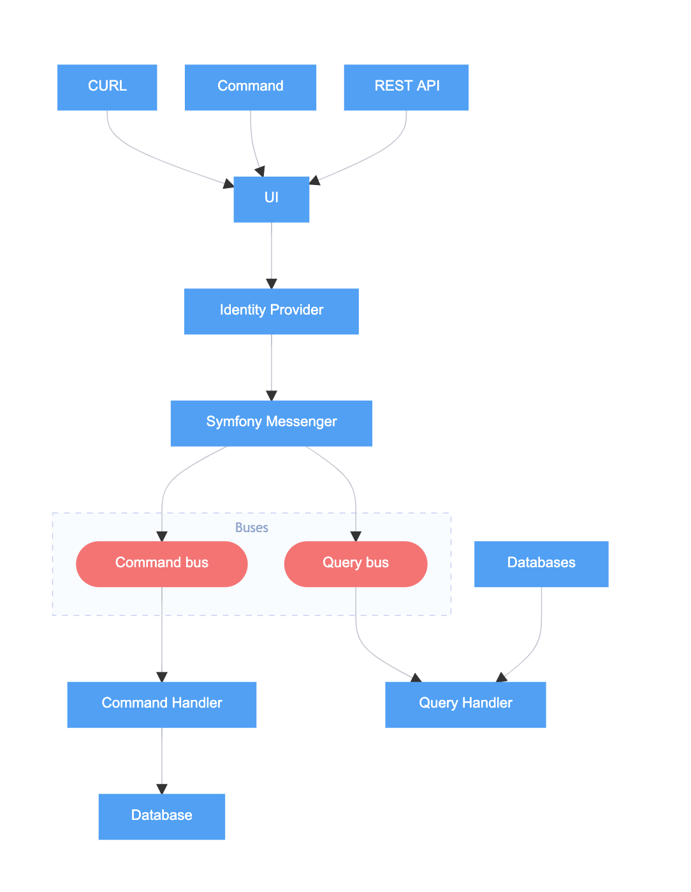
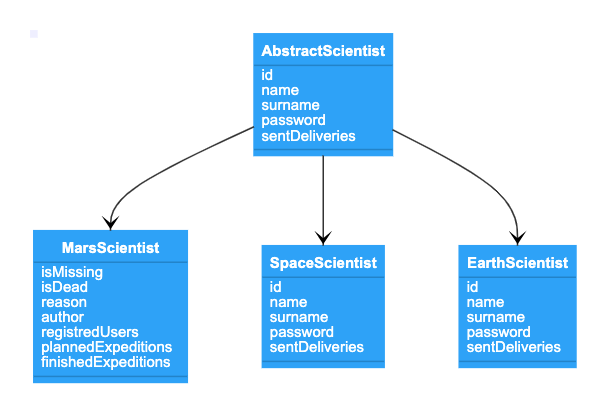
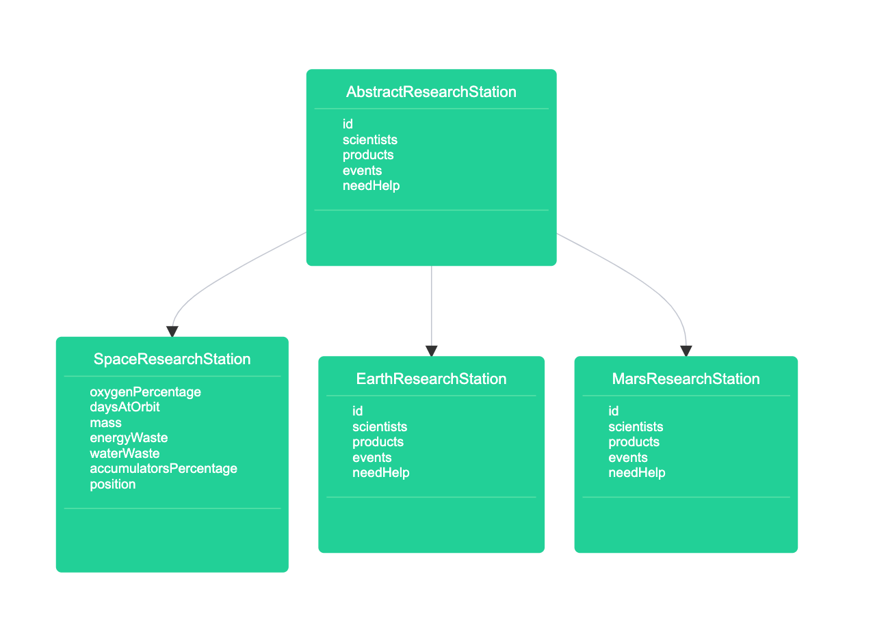

# polonia-in-space

# Run app
```
$ symfony serve
```
# Run tests
```
$ php vendor/bin/phpunit tests
```
# Run code style and PHPStan
```
$ vendor/bin/ecs check --config vendor/landingi/php-coding-standards/ecs.php
$ vendor/bin/phpstan analyze -c phpstan.neon
```



